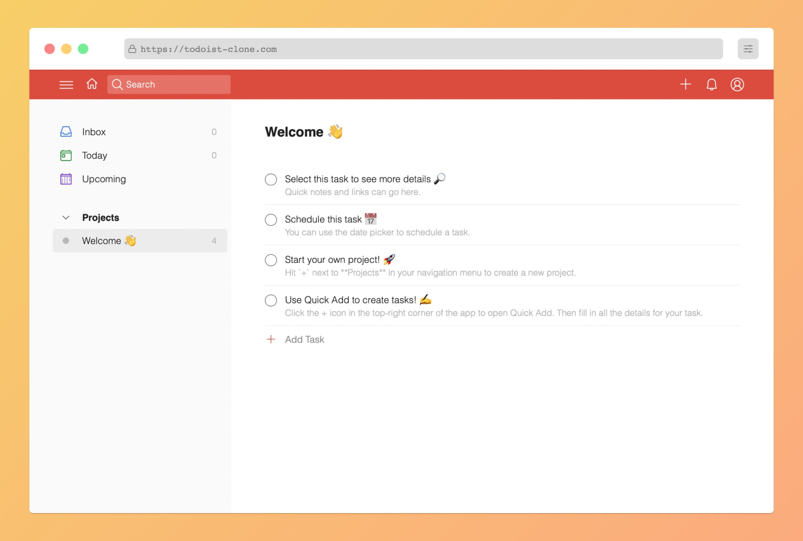

<h1 align="center">A simplified Todoist clone</h1>
<h3 align="center">Build with React and Firebase. Styled with Sass. Tested with Cypress.</h3>

[Go to live app](https://todoist-clone.com/)

## What is this and who is it for ⭐

This is a simplified Todoist clone built with React and Firebase.
I've built it while pursuing the [The Frontend Developer Career Path on Scrimba](https://scrimba.com/learn/frontend).

It's a more _complex_ coding project than anything I've attempted previously (as of February 2022), as I wanted to:

- Practice React under more _real-world_ conditions to find and push my limits.
- Experience some of the pain points and needs of a growing codebase (e.g. managing state, organizing files, automated testing, ...).
- Go from zero to a fully deployed web app for the first time.

This project might be interesting for anyone learning React, who's looking for a practice project that's...

- ... challenging, but not overwhelming.
- ... using 'pure' React and vanilla JS (no Redux, jQuery, Typescript, ... ).
- ... frontend focused (backend implemented via Firebase / Firestore).
- ... focused on CRUD operations.

I hope it helps you to become a better React programmer, too 🤓.

## Features

- Written in **modern React**, only functional components with hooks
- **Simple** vanilla React **state management** (without Redux, Recoil or similar)
- **Todoist UI** (as of February 2022)
- **User authentification** via Firebase
- Create, edit and delete **projects**
- Create, edit, delete and assign **tasks** to projects
- **End-to-end tested** with Cypress

## Getting started 🛠

- Signup for a [Firebase account](https://firebase.google.com/) if you don't have it already, create a new project, then set up a web app.
- Inside Firebase, set up Firestore and create two collections `projects` and `tasks`.
- Inside Firebase, set up Firebase authentification and enable Email/Password, Anonymous, and Google SignIn.
- `git clone https://github.com/maker0101/todoist`
- Create an empty `.env.local` file in the root directory, copy `.env.local.example` contents into it, and fill `XXX` placeholders with your Firebase project credentials.
- `npm install`
- `npm start`
- App should now be running on `http://localhost:3000/`.

## Shortcomings

I'm aware of the following shortcomings listed below:

### Performance 🚀

The current app implementation triggers too many component re-renders as I'm relying too heavily on the useEffect hook - even for states changing frequently.

I would expect a significant performance boost by refactoring contexts/components or by using an external state management library.

### Security 🔒

Creating separate production and development environments in firebase should enhance the app's security. This would allow you for example to remove `localhost` from the list of authorized domains. In addition, firestore security rules could be stricter on the development version.

In addition, adding more advanced form data validations should increase the app's security further, reducing the threat, e.g. from SQL injection attacks.

### Styling 🎨

All styles are currently located in a single, large _App.scss_ file. Splitting up the CSS into multiple CSS files per component would greatly improve code maintainability.

Additionally, some CSS repetitions could have been avoided by implementing a basic component library first (e.g. for texts, buttons, tables, ...) first and only then start implementing more complex components.

### Data management 🗄

Automatic database cleanups are currently missing (e.g. when project or user is deleted).

### Accessibility ♿

No extra efforts have been put into making this project more accessible. For a production-ready app, adding aria roles and keyboard support would go a long way into making the app more accessible.

### Testing 🧪

Core user flows have been covered with end-to-end tests utilizing Cypress. However, for a real production setup I would recommend to:

- Add unit, functional, integration / visual tests
- Separate test db from production db
- Perform repeating actions programmatically (e.g. login)
- Cover missing user flows (e.g. Google signup/login)
- Run tests for different environments (browsers, screen sizes, operating systems)
- Calculate and track test coverage

## Author: Max Breitsprecher

- Website: [maxbreitsprecher.com](https://www.maxbreitsprecher.com/)
- Email: max.breitsp@gmail.com
- Github profile: [github.com/maker0101](https://github.com/maker0101)

If you have any questions or feedback, feel free to say hi. 👋

## License

[MIT](https://opensource.org/licenses/MIT)

## Shout out

- This project was originally inspired by Karl Hadwen's YouTube tutorial [Building Todoist From Scratch](https://youtu.be/HgfA4W_VjmI).
- Big thanks to my awesome code tutor [Esen](https://github.com/snqb) for his patience, encouragement, and super valuable code reviews.

## Disclaimer

This project is for entirely educational purposes. It is in no way connected to Todoist the app or Doist the company behind Todoist. I'm just a fan of their app and figured it would be a fun, educational challenge to recreate a simplified web-app version of it.
