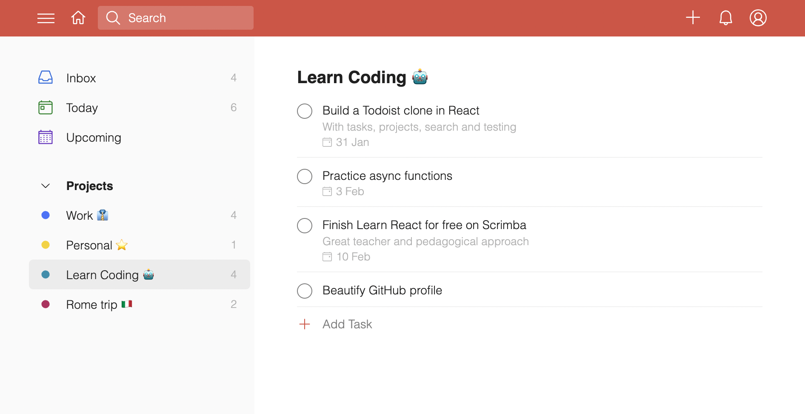

<h1 align="center">A simplified Todoist clone built with React and Firebase</h1>

## What is this and who is it for ⭐

This is a simplified Todoist clone built with React and Firebase.
I've built it while pursuing the [The Frontend Developer Career Path on Scrimba](https://scrimba.com/learn/frontend).

It's a more _complex_ coding project than anything I've attempted previously (as of February 2022), as I wanted to:

- Practice React under more _real-world_ conditions to find and push my limits.
- Experience some of the pain points and needs of a growing codebase (e.g. managing state, organizing files, automated testing, ...).
- Go from zero to a fully deployed web app for the first time.

This project might be interesting for anyone learning React, who's looking for a practice project that's...

- ... challenging, but not overwhelming.
- ... using 'pure' React and vanilla JS (no Redux, jQuery, Typescript, ... ).
- ... frontend focused (backend implemented via Firebase / Firestore).
- ... focused on CRUD operations.

I hope it helps you to become a better React programmer, too 🤓.

## Features

- Written in **modern React**, only functional components with hooks
- **Simple** local React **state management** (without Redux, Recoil or similar)
- **Todoist UI** (as of February 2022)
- **User authentification** via Firebase
- **Project CRUD** operations
- **Task CRUD** operations and simple Search
- **End-to-end tested** with Cypress

## Getting started

### Setting up development environment 🛠

TBD

### Running automated tests 🚥

TBD

## What's missing?

TBD

### Features

TBD

### Authentification system 🔐

TBD

### Migrations 🗄

TBD

### Accessibility ♿

TBD

### Test coverage 🧪

TBD

## Author: Max Breitsprecher

- Website: TBD
- Email: TBD
- Github profile: TBD

If you have any questions or feedback, feel free to say hi via email. 👋

## License

[MIT](https://opensource.org/licenses/MIT)

## Shout out

- This project was originally inspired by Karl Hadwen's YouTube tutorial [Building Todoist From Scratch](https://youtu.be/HgfA4W_VjmI).
- Big thanks to my awesome code tutor [Esen](https://github.com/snqb) for his patience, encouragement and super valuable code reviews.
